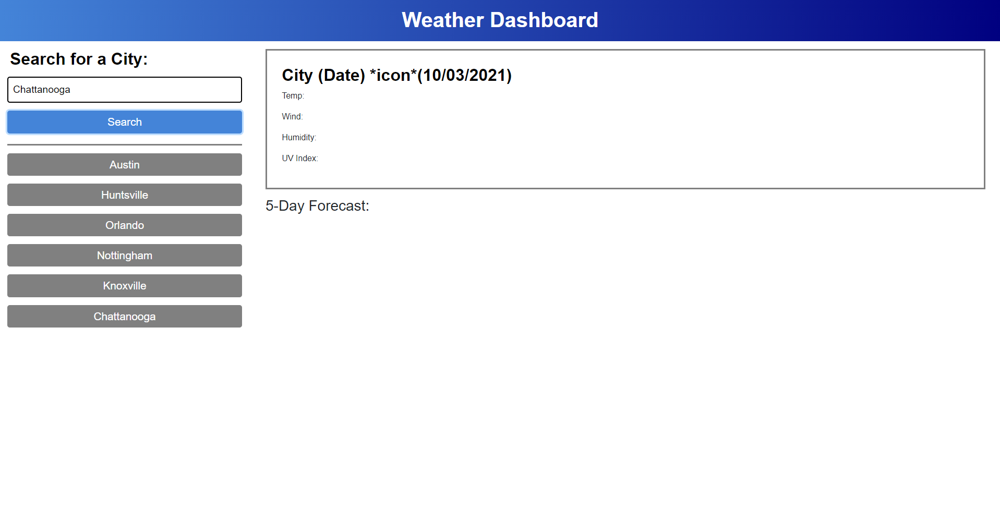

# Challenge 6: Weather Dashboard
for UCF Coding Bootcamp

## Link to the Live Page
https://michmash2010.github.io/weather-dashboard/

## Description
This page features the use of the Server-Side API from OpenWeather to display the upcoming weather from several cities of interest.  Other featured technologies are HTML and CSS.

## Weather Dashboard Webpage Screenshot

## Credits
A mock-up for the basic design/appearance of the Weather Dashboard Webpage was included in the assignment.